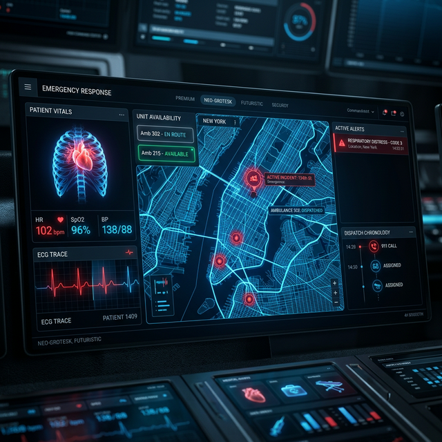

# VitalNet: AI-Powered Emergency Medical Response System



## 🏆 Samsung Innovation Program Capstone Project

**VitalNet** is a comprehensive, real-time emergency medical coordination platform. It utilizes AI-driven triage and a unified data mesh to connect patients, ambulances, and hospitals, reducing critical response times and optimizing resource allocation.

---

## ✨ Key Features

### 🩺 1. AI Patient Triage (P1/P2/P3)
- Instant symptom analysis using medical NLP simulation.
- Automated priority categorization to ensure critical cases get immediate attention.
- Real-time vitals monitoring from the patient dashboard.

### 🚑 2. Smart Ambulance Dispatch & Relay
- Dynamic Leaflet-based mapping for route optimization.
- Live telemetry relay: Patient vitals are streamed en-route directly to the ER.
- Mission HUD with ETA and traffic delay calculations.

### 🏥 3. Hospital Command Center
- Real-time resource mesh for tracking Bed Occupancy and Blood Bank levels.
- High-priority incoming patient alerts with live ETA tracking.
- Operational feed for cross-department coordination.

---

## 🛠️ Tech Stack

- **Framework**: [Next.js 15+](https://nextjs.org/) (App Router)
- **Language**: [TypeScript](https://www.typescriptlang.org/)
- **Styling**: [Tailwind CSS](https://tailwindcss.com/)
- **Animations**: [Framer Motion](https://www.framer.com/motion/)
- **Icons**: [Lucide React](https://lucide.dev/)
- **Mapping**: [Leaflet](https://leafletjs.com/) & [React Leaflet](https://react-leaflet.js.org/)
- **AI Logic**: Custom simulated triage engine (`src/lib/vital-engine.ts`)

---

## 🚀 Getting Started

### Prerequisites
- Node.js 18.x or later
- npm or pnpm

### Installation

1. Clone the repository:
   ```bash
   git clone https://github.com/your-username/vitalnet.git
   cd vitalnet
   ```

2. Install dependencies:
   ```bash
   npm install
   ```

3. Run the development server:
   ```bash
   npm run dev
   ```

4. Open [http://localhost:3000](http://localhost:3000) in your browser.

---

## 📁 Project Structure

```text
src/
├── app/              # App Router pages (Home, Patient, Ambulance, Hospital)
├── components/       # Reusable UI components (Hero, Features, MapView, Navbar)
├── lib/              # Core logic & Utility functions (Vital Engine, cn utility)
├── public/           # Static assets & AI-generated mockups
```

---

## 👥 Meet the Team

Developed by a team of 6 students for the **Samsung Innovation Program**:
1. [User Name] - Lead Developer / AI Integration
2. Team Member 2 - UI/UX Design
3. Team Member 3 - Frontend / Maps logic
4. Team Member 4 - Resource Management Core
5. Team Member 5 - Documentation & Impact Analysis
6. Team Member 6 - Testing & Quality Assurance

---

## 📄 License

This project is licensed under the MIT License - see the [LICENSE](LICENSE) file for details.

---

## 🌟 Acknowledgments
- Special thanks to the **Samsung Innovation Program** mentors.
- Built with a focus on Sustainable Development Goal 3: Good Health and Well-being.
